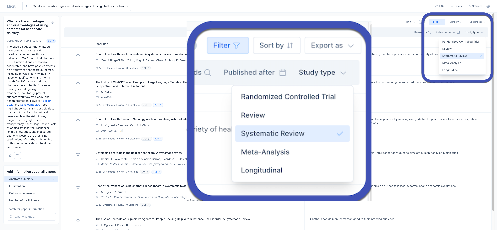
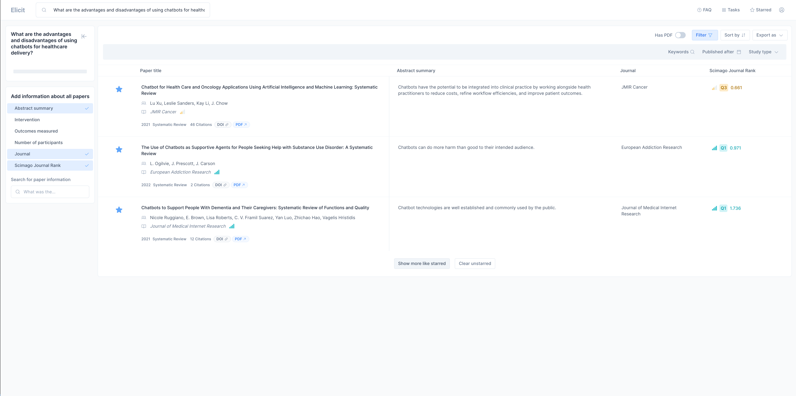

# Literaturrecherche mit Elicit

## Beschreibung

Elicit ist ein KI-basiertes Forschungsassistenzsystem, das bei der Literaturrecherche eingesetzt werden kann. Es beschleunigt die Suche und Auswahl von Literatur. 

Ausgehend von einer Fragestellung zeigt Elicit relevante Arbeiten an und stellt diese mit Zusammenfassungen in einer *Tabelle* dar. Anwender:innen können diese interaktive Tabelle und die Zusammenfassungen nutzen, um weitere Vorschläge zu generieren und sich damit eine Auswahl an wissenschaftlichen Quellen zusammenzustellen. 

Das folgende Beispiel zeigt, wie dieses KI-basiertes Werkzeug in der Anfangsphase einer Literaturrecherche eingesetzt werden kann. 

Eine weitere Anwendungsmöglichkeit ist die Literaturrecherche in der Schlussphase deiner wissenschaftlichen Arbeit, um deine Forschungsergebnisse in den Kontext des aktuellen Forschungsstandes zu stellen (z.B. im Diskussionsteil deines Berichts). Du kannst deine Hauptergebnisse in Form von Aussagen oder Fragen formulieren, um nach Quellen zu suchen, die deine Ergebnisse stützen oder widerlegen.


---

## Beispiel: Sichtung und Auslese von Quellen

Dieses Beispiel zeigt, wie Elicit verwendet werden kann, um eine Auswahl an Literatur zusammenzustellen. Ziel in diesem Beispiel ist es, wissenschaftliche Quellen zur Fragegestellung "What are the advantages and disadvantages of using chatbots for healthcare delivery?" zu identifizieren. Ausgehend von der Forschungsfrage wurden in mehreren Schritten Vorschläge generiert, gefiltert und aussortiert.


???+ info "Bemerkung"

    Bitte beachte, dass die hier gezeigten Schritte **keine Anleitung für eine systematische Recherche** darstellen. Das Beispiel dient in erster Linie dazu, dir einige Möglichkeiten aufzuzeigen, wie du mit diesem Werkzeug arbeiten kannst. 
    
    Bedenke, dass es in deiner Verantwortung liegt, die Relevanz der Quellen und die Richtigkeit der generierten Zusammenfassungen zu überprüfen. Als in der Forschung tätige Person musst du auch in der Lage sein, den Inhalt der gesichteten Literatur zu verstehen und zu interpretieren.

---


**Schritt 1: Erste Vorschläge mit einer Forschungfrage generieren**


Als erstes wird folgende Fragestellung eingegeben, um die ersten Vorschläge zu generieren:

*"What are the advantages and disadvantages of using chatbots for healthcare delivery?"* 

<!--
{: style="width:500px"}
-->


---

**Schritt 2: Die Filterfunktion nutzen, um die Suche nach Reviews einzugrenzen**

Um die Suche einzugrenzen sollen nur systematische Übersichtsarbeiten (Systematic Reviews) angezeigt werden. Dazu wird die Filterfunktion genutzt.



---

**Schritt 3: Weitere Informationen in der Tabelle anzeigen lassen**

Wir möchten mehr Informationen in die Auswahl einbeziehen. Zum Beispiel interessieren uns die *Publikationsplattformen* und deren *Scimago Journal Ranking*.

Wähle dazu die entsprechenden Optionen im Feld unten links aus:


---

**Schritt 4: Weitere Vorschläge generieren**

Bei der Durchsicht der Tabelle entdecken wir unter den Vorschlägen 3 Quellen, die für uns relevant sind. Wir möchten jedoch weitere Quellen hinzufügen und die weniger relevanten aussortieren:  

- Dazu ***markieren*** wir die Quellen, die wir behalten möchten.
- Dann sortieren wir mit ***Clear Unstarred*** die nicht relevanten Quellen aus
-  und generieren mit ***Show more like starred*** weitere Vorschläge, bis wir eine Auswahl relevanter Quellen zusammengestellt haben.
-  Für die Auswahl der Quellen lesen wir die Abstracts, indem wir die Inhalte direkt aus der Tabelle öffnen.<br> 

Quellen markieren, um sie zu behalten:


Aussortierte Liste nach ***Clear unstarred***:


Resultat nach mehreren Vorschlagsgenerierungen und Aussortierungen (Markieren --> ***Clear*** --> ***Show more like starred*** -->  Markieren --> ...):


Einsicht in eine Quelle zur Entscheidung, ob sie eingeschlossen werden sollte:


---

## Tipps:

- Nutze ***Export as***, um die fertige Literaturliste als BIB- oder CSV-Datei zu exportieren. Diese kann bei Bedarf in dein Literaturverwaltungsprogramm importiert werden.

- Notiere die Quellen bzw. deine Ergebnisse in einem ***separaten Dokument***. Elicit befindet sich noch in einem frühen Entwicklungsstadium. Es kann sein, dass das System nicht mehr reagiert.

- Recherchiere auf der Entwicklerseite von Ought nach weiteren Einsatzmöglichkeiten.

- Die Nutzung von Elicit ersetzt keine Recherche mit PubMed oder IEEEXplore. Sei dir bewusst, dass Elicit nur bestimmte Quellen durchsucht und beispielsweise Preprints anzeigt (Publikationen ohne Begutachtung). 

---

## Tools 

```yaml
condition: or
entityType: tool
rules:
- condition: equals
  property: id
  value: elicit
```

---

## Risiken

```yaml
condition: or
entityType: risk
rules:
- condition: contains
  property: id
  value: abnahme-reflexionsfaehigkeit
- condition: contains
  property: id
  value: fehlende-transparenz
- condition: contains
  property: id
  value: gesellschaftlicher-bias
- condition: contains
  property: id
  value: kompetenzverlust
- condition: contains
  property: id
  value: nachvollziehbarkeit
- condition: contains
  property: id
  value: plagiate
```


---


## Chancen

```yaml
condition: or
entityType: chance
rules:
- condition: contains
  property: id
  value: kompetenzerwerb-durch-ki
```


---


## Links

Elicit:

- Elict App: https://elicit.org/
- Elicit FAQ: https://elicit.org/faq
- Entwicklerseiter: https://ought.org/elicit
- Youtube Channel: https://www.youtube.com/@Oughtinc

Jan Hendrik Kirchner erklärt, wie er Elicit zur schnellen Erstellung von Forschungsvorschlägen nutzte.

- https://youtu.be/YO9UiBWx6jw

---

## Quellen
