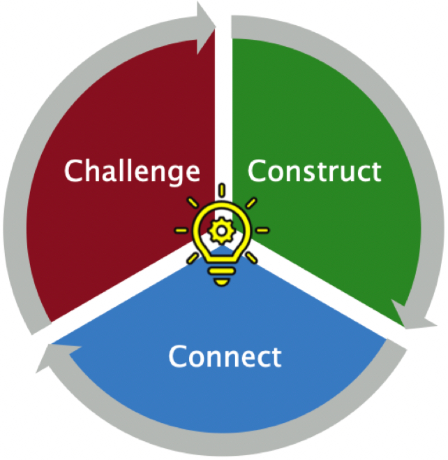
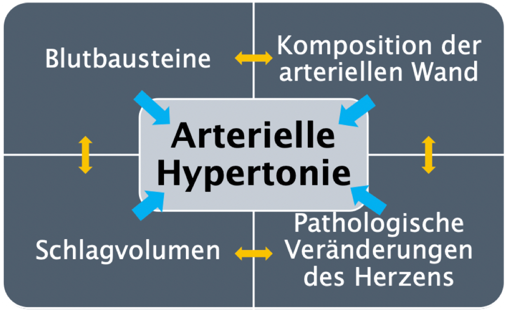
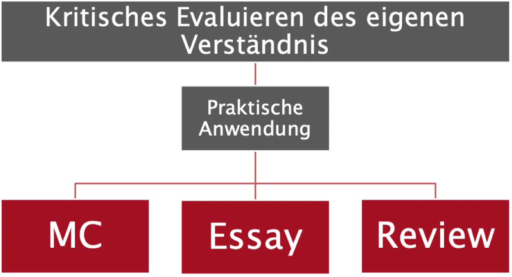

## Drei Phasen 


Der von Luka Dimitrijevic vorgeschlagene Drei-Phasen-Ansatz strukturiert den Lernprozess in drei aufeinander aufbauenden Schritten. 


{style="width:200px"} <br>
*Abb.: 3-Phasen-Konzept, von Luka Dimitrijevic*

Ziel ist es, aus Informationen Wissen zu erarbeiten, die als Grundlage dienen und in weiteren Schritten vertieft und miteinander verknüpft werden. Abschliessend wird das erworbene Wissen durch Anwendung gefestigt.


**Construct-Phase (Aufbau):** 

Hier wird Grundwissen und essenzielle Informationen zu einem Thema gesammelt. Es geht um die Identifizierung und das Verständnis der Grundkonzepte, die für das weitere Lernen notwendig sind. 

Die KI kann in dieser Phase als Instrument dienen, um Informationen zu sammeln und strukturiert darzustellen. Beispielsweise kann ChatGPT dazu verwendet werden, einen strukturierten Lehrplan zu einem bestimmten Thema zu erstellen und helfen, wichtige Inhalte zu identifizieren und hervorzuheben.

--> Insert UseCase für Lehrplan erstellen.


**Connect-Phase (Verknüpfung):** 

Nachdem das Grundwissen erarbeitet wurde, geht es in der Connect-Phase darum, die Beziehungen und Zusammenhänge zwischen den verschiedenen Informationen zu erkennen und zu verstehen. Hier wird versucht, tiefere Zusammenhänge zu erkennen, was zu kritischem Denken anregt und ein umfassenderes Verständnis ermöglicht. 

KI kann dabei helfen, komplexe Informationen zu organisieren und zu strukturieren, um Verbindungen leichter erkennbar zu machen.


--> Insert UseCase für Dialog: Wissensbausteine Verbinden, Erklärung von zusammenspiel, Folgefragen

{style="width:300px"} <br>
*Abb.: Verknüpfung von "Wissensbausteinen", von Luka Dimitrijevic*


**Challenge-Phase (Herausforderung):**

In der letzten Phase wird das angeeignete Wissen angewendet und überprüft. Das kann durch die Durchführung eines Quiz, oder die Überprüfung von selbstgeschriebenen Zusammenfassungen geschehen.

KI-Tools können hier zum Einsatz kommen, um beispielsweise Übungen zu generieren oder Feedback zu Zusammenfasungen zu geben.


{style="width:300px"} <br>
*Abb.: Selbstüberprüfung, von Luka Dimitrijevic*


--> Insert UseCaseQuiz erstellung

--> Insert UseCase Zusammenfassung eingeben und bewerten


---

## Relevante Anwendungsfälle
Bei diesen Anwendungsfällen könnten die hier aufgeführten Hinweise und Beispiele angewendet werden:

```yaml
condition: or
entityType: usecase
rules:
- condition: contains
  property: id
  value: chatgpt
```

---


## Links

ChatGPT Best Practices (OpenAI API):

-	https://platform.openai.com/docs/guides/gpt-best-practices


Video des Discord Events, wo Luka Dimitrijevic seine Konzepte vorstellte:

- https://www.youtube.com/watch?v=R9V8KjDD39w


---


## Über diesen Beitrag

Beim Verfassen dieses Beitrags haben die Autor:innen ChatGPT-4 (Ver. 21.11.23), DeepL Write (Beta Ver. 21.11.2023) verwendet, um die sprachliche Darstellung ihrer Gedanken zu verbessern. Die volle Verantwortung für den Inhalt liegt bei den Autor:innen.

### Lizenz

{ align=left } Dieser Beitrag enthält Inhalte, die auf dem Modell (Construct, Connect, Challenge) von Luka Dimitrijevic basieren und wurde zusammen mit dem zugrunde liegenden Konzept während eines
<a rel="Discord-Event" href="https://www.youtube.com/watch?v=R9V8KjDD39w">Discord-Events am 3. November 2023 </a> im Rahmen des Projekts <a rel="bildung6" href="https://belearn.swiss/projekt/bildung-6-0-lernen-und-lehren-mit-ku%cc%88nstlicher-intelligenz-inklusion-statt-disruption/"> Bildung 6.0  </a> /  <a rel="belearn" href="https://belearn.swiss/"> BeLEARN </a> vorgestellt. Die inhaltliche und textliche Bearbeitung erfolgte durch das Projektteam von Bildung 6.0 / BeLEARN. Sowohl das Modell (Construct, Connect, Challenge) als auch das dazugehörige Konzept und dieser Beitrag stehen unter der <a rel="license" href="http://creativecommons.org/licenses/by-sa/4.0/">Creative Commons Attribution ShareAlike 4.0 (CC BY-SA 4.0 International License) </a> Lizenz.


