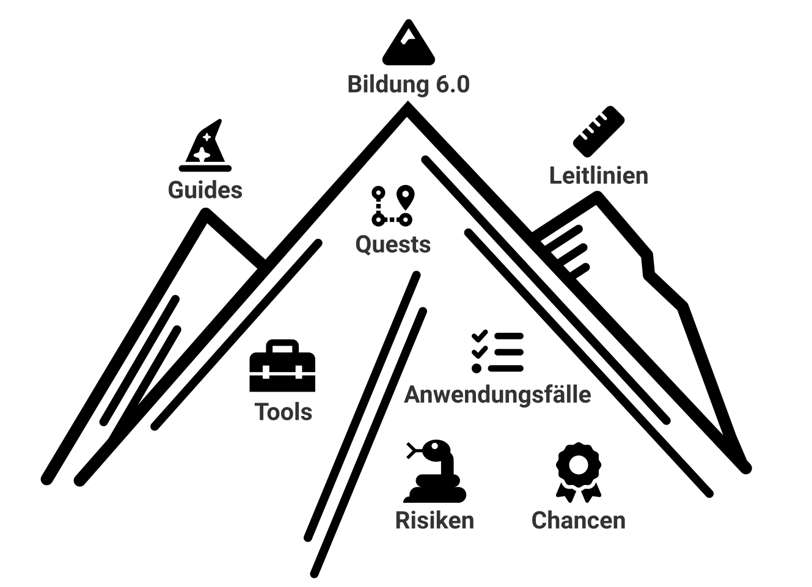

        
        <a class="" href="../quests/" style="left: 40.5%; top: 27.9%; cursor: pointer;">
         Quests
        </a>
        <a class="" href="../chancenrisiken/risiken" style="top: 72.8%; left: 45.8%; cursor: pointer;">
         Risiken
        </a>
        <a class="" href="../chancenrisiken/chancen" style="top: 73.1%; left: 63.6%; cursor: pointer;">
         Chancen
        </a>
        <a class="" href="../guides/" style="top: 18.2%; left: 17.9%; cursor: pointer;">
         Guides
        </a>
        <a class="" href="../leitlinien/" style="left: 65.5%; top: 15.6%; cursor: pointer;">
         Leitlinien
        </a>
        <a class="" href="../tools/" style="left: 27%; top: 55.2%; cursor: pointer;">
         Tools
        </a>
        <a class="" href="./" style="left: 42.3%; top: 0.8%; cursor: pointer;">
         Bildung 6.0
        </a>
        <a class="" href="../anwendungsf%C3%A4lle/" style="left: 49%; top: 52.9%; width: 25%; cursor: pointer;">
         Anwendungsfälle
        </a>
       

Das Projekt Bildung 6.0 stellt relevante und verlässliche Informationen und Empfehlungen zum richtigen Umgang mit KI-basierten Werkzeugen für Studierende und Lehrende auf einer Online-Plattform bereit.

## Steckbrief

- **Lead-Departement:** Technik und Informatik
- **Institut:** Institut für Medizininformatik I4MI
- **Themenfeld:** Humane Digitale Transformation
- **Förderorganisation:** BFH
- **Laufzeit (geplant):** 01.03.2023 - 31.12.2023
- **Projektleitung:** Prof. Dr. Kerstin Denecke
- **Projektmitarbeitende:** Daniel Reichenpfader, Robin Glauser, Denis Moser
- **Schlüsselwörter:** Künstliche Intelligenz, Hochschullehre, Ethik

## Ausgangslage

Verschiedene Formen von Künstlicher Intelligenz (KI) sind mittlerweile in vielen Bereichen des Alltags präsent. Auch in der Hochschulbildung besteht Potenzial, Lehrende und Studierende mit KI-basierten Werkzeugen zu unterstützen. Zum jetzigen Zeitpunkt agiert KI nicht immer verlässlich – eine kritische Reflexion der KI-generierten Ergebnisse ist somit unerlässlich. Sind jedoch die entsprechenden «Digital Skills» vorhanden, können KI-basierte Werkzeuge zu effizientem und effektivem Lehren und Lernen beitragen.

## Vorgehen

- Mittels Internet- und Literaturrecherche wird ein Überblick über bestehende KI-basierte Werkzeuge ermittelt. 
- Anschliessend werden die speziellen Bedürfnisse der Studierenden und Lehrenden erhoben. Beispielsweise werden zeitaufwändige, mühsame oder repetitive Tätigkeiten ermittelt, die mit KI-basierten Werkzeugen unterstützt werden können. 
- Anhand von Anwendungsfällen werden auf einer Plattform Informationen und Tools zusammengestellt, wie KI in der Hochschullehre unterstützen kann. 
- Zusätzlich werden Leitlinien zum kritischen Umgang mit diesen Werkzeugen erarbeitet.

## Ergebnisse

Zu erwartende Ergebnisse sind die Plattform zu KI-basierten Werkzeugen in der Lehre und Leitlinien zum kritischen Umgang mit ihnen.

## Förderung

{.belearn}

Das Projekt wird im Rahmen des Förderprogramms [BeLearn](https://belearn.swiss/projekt/bildung-6-0-lernen-und-lehren-mit-ku%cc%88nstlicher-intelligenz-inklusion-statt-disruption/) gefördert.

## Beitrag zu den SDGs

{.sdg .sdg-4}
{.sdg .sdg-5}
{.sdg .sdg-10}

## Lizenz

 This work is licensed under a <a rel="license" href="http://creativecommons.org/licenses/by-sa/4.0/">Creative Commons Attribution-ShareAlike 4.0 International License</a>

BeLearn Bildung 6.0 Informationsplattform

Kerstin Denecke, Robin Glauser, Denis Moser, Daniel Reichenpfader 

BFH Technik und Informatik, 21. Juli 2023, lizenziert unter CC BY-SA 4.0 International
