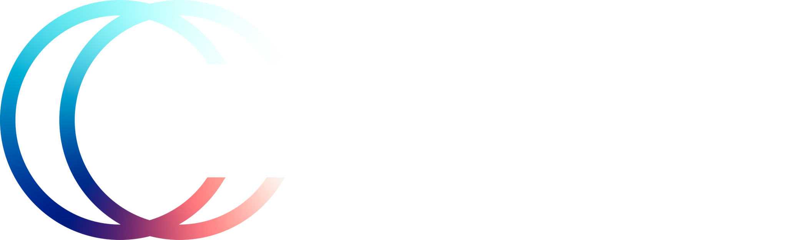
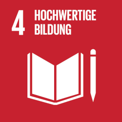
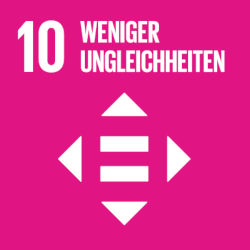

<object data="projekt.svg"></object>

Das Projekt Bildung 6.0 stellt relevante und verlässliche Informationen und Empfehlungen zum richtigen Umgang mit KI-basierten Werkzeugen für Studierende und Lehrende auf einer Online-Plattform bereit.

## Steckbrief

- Lead-Departement: Technik und Informatik
- Institut: Institut für Medizininformatik I4MI
- Themenfeld: Humane Digitale Transformation
- Förderorganisation: BFH
- Laufzeit (geplant): 01.03.2023 - 31.12.2023
- Projektleitung: Prof. Dr. Kerstin Denecke
- Projektmitarbeitende: Daniel Reichenpfader, Robin Paul Glauser
- Schlüsselwörter: Künstliche Intelligenz, Hochschullehre, Ethik

## Ausgangslage

Verschiedene Formen von Künstlicher Intelligenz (KI) sind mittlerweile in vielen Bereichen des Alltags präsent. Auch in der Hochschulbildung besteht Potenzial, Lehrende und Studierende mit KI-basierten Werkzeugen zu unterstützen. Zum jetzigen Zeitpunkt agiert KI nicht immer verlässlich – eine kritische Reflexion der KI-generierten Ergebnisse ist somit unerlässlich. Sind jedoch die entsprechenden «Digital Skills» vorhanden, können KI-basierte Werkzeuge zu effizientem und effektivem Lehren und Lernen beitragen.

## Vorgehen

- Mittels Internet- und Literaturrecherche wird ein Überblick über bestehende KI-basierte Werkzeuge ermittelt. 
- Anschliessend werden die speziellen Bedürfnisse der Studierenden und Lehrenden erhoben. Beispielsweise werden zeitaufwändige, mühsame oder repetitive Tätigkeiten ermittelt, die mit KI-basierten Werkzeugen unterstützt werden können. 
- Anhand von Anwendungsfällen werden auf einer Plattform Informationen und Tools zusammengestellt, wie KI in der Hochschullehre unterstützen kann. 
- Zusätzlich werden Leitlinien zum kritischen Umgang mit diesen Werkzeugen erarbeitet.

## Ergebnisse

Zu erwartende Ergebnisse sind die Plattform zu KI-basierten Werkzeugen in der Lehre und Leitlinien zum kritischen Umgang mit ihnen.

## Förderung

{.belearn}

Das Projekt wird im Rahmen des Förderprogramms [BeLearn](https://belearn.swiss/projekt/bildung-6-0-lernen-und-lehren-mit-ku%cc%88nstlicher-intelligenz-inklusion-statt-disruption/) gefördert.

## Beitrag zu den SDGs

{.sdg .sdg-4}
{.sdg .sdg-5}
{.sdg .sdg-10}
